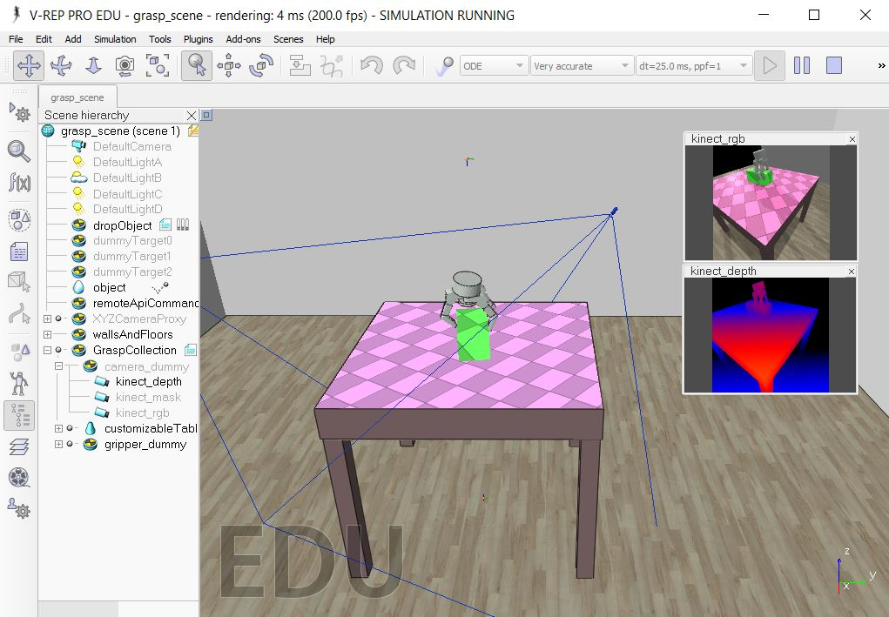
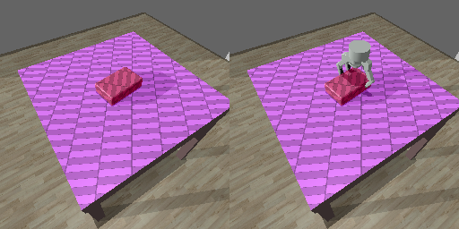
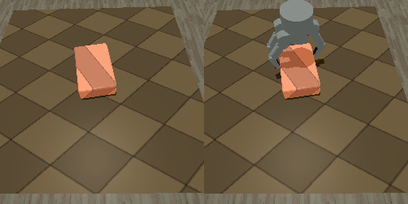
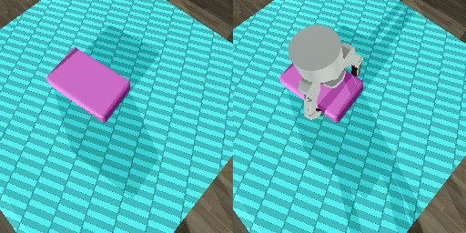
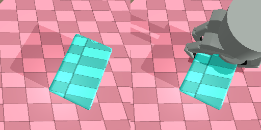
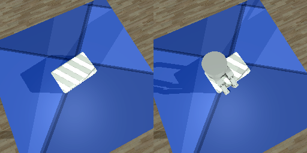

# multi-contact-grasping

This project implements a simulated grasp-and-lift process in V-REP using the Barrett Hand, with an interface through a python remote API. The goal of this project is to collect information on where to place individual contacts of a gripper on an object. The emphasis on constraining the grasp to specific contacts is to promote future work in learning fine manipulation skills. 

This is an extension of [a previous project](https://github.com/mveres01/grasping), which largely simplifies the collection process, and introduces domain randomization into the image collection scheme.

<p align="center">
  
</p>


## Sample Data

Sample data can be viewed [Here](https://drive.google.com/open?id=1AspKT7BFPMjVqkFIZyVCPTmL3fPiJ4Pb), which makes use of the first 100 [Procedurally Generated Random Objects](https://sites.google.com/site/brainrobotdata/home/models) from Google. For each object, all sub-collision objects were merged into a single entity, rescaled to fit the Barrett Hand, and saved in the meshes/ folder. 10 Grasps were attempted for each object, and images were saved in the .PNG format. 


# Installation

* Download and Install Python 2.7
* Download and Install V-REP (http://www.coppeliarobotics.com/downloads.html)
* (optional) Mesh files in either .obj or .stl format; a sample mesh has been provided in _./data/meshes_.
* (optional) an Xserver if running V-REP in headless mode (i.e. no GUI). 

Install the trimesh library:
```
pip install trimesh==2.29.10
```

Add the remote API interfaces by copying the following files to _lib/_:
* __vrep.py__ and __vrepConst.py__ from 
_path/to/vrep/V-REP_PRO_EDU/programming/remoteApiBindings/python/python/_ 
* __remoteApi__ from: path/to/vrep/V-REP_PRO_EDU/programming/remoteApiBindings/lib/lib/64Bit/

# Collect Grasping Experience
Open _scenes/grasp_scene.ttt_ in V-REP. You should see a table, a few walls, and a Barrett Hand. 

Start the scene by clicking the play (triangle) button at the top of the screen. Run the main collection script in src/collect_grasp.py:

```
cd src
python collect_grasps.py
```

This will look in the folder _data/meshes_, and run the first mesh it finds. You should see a mesh being imported into the scene, falling onto the table, then after a short delay a gripper should begin to attempt grasping it. When the gripper closes, it will check whether all the fingertips of the Barrett Hand are in contact with the object - if so, it will attempt to lift the object to a position above the table. Successful grasps (where the object remains in the grippers palm) are recorded and saved in an hdf5 dataset for that specific object in the _output/collected_ folder.

For both pre- and post-grasp, the following information is recorded:

| Simulation Property | What's Recorded|
| ----------------- | ------------------------------- |
| Reference frames | palm, world, workspace, object |
| Object properties | mass, center of mass, inertia |
| Joint angles | All joints of Barrett Hand |
| Contacts | positions, forces, and normals |
| Images | RGB, depth, and a binary object mask |

# Supplementing the Dataset with Images

Once data collection has finished, we can supplement the dataset with images by indexing the .hdf5 files in the _output/collected/_ directory:

```
cd src
python collect_images.py
```

We first remove potential duplicates grasps from the dataset (based on wrist pose, then contact positions & normals), and remove any extreme outliers. Feel free to modify this file to suit your needs. Next, the simulation will open up or connect to a running V-REP scene, and begin collecting images using data from _output/grasping.hdf5_. This script uses the state of the simulator at the time of the grasp (i.e. the object pose, gripper pose, angles, etc ...) and restores those parameters before taking an image. 

Image randomization is done according to the following properties:

| Render Property | What's Affected |
| ----------------- | ------------------------------- |
| Lighting | Number of lights, relative position |
| Colour | Random RGB for object and workspace |
| Colour Components | Ambient diffuse, specular, emission, auxiliary |
| Texture Mapping | Plane, sphere, cylinder, cube |
| Texture Pose | Position, Orientation |
| Camera | Pose (Resolution, Field of View, near/far planes also supported) |

Data from this phase is stored in the _output/processed/_ folder, where the _*.hdf5_ file stores the grasp metadata, and images are stored in the corresponding directory. RGB images of the object, object + gripper are stored in the .jpg format, while the depth image is stored as a 16-bit floating point numpy array.

Sample images of the pre-grasp:

<p align="center">
  
  
  
  
  
</p>


# A Few things to Note:

This project is still under construction, so things may still be changing. Additionally, a few points to consider:

1. __Complex meshes are difficult to properly simulate__:  Pure / convex meshes are preferred. There is an option to approximate complex objects with a convex hull, but note that this will change the physical shape of the object, and in some cases may yield weird-looking grasps (i.e. not touching the mesh surface, but touching the hulls surface).
2. __The object is static during the pregrasp, and dynamically simulated during the lift__: This avoids potentially moving the object before the fingers come into contact with it.
3. __The same object pose is used for each grasp attempt__: This avoids instances where an object may accidentally fall off the table, but can be removed as a constraint from the main script.
4. __A grasp is successful if the object is in the grippers palm at the height of the lift__: A proximity sensor attached to the palm is used to record whether it detects an object in a nearby vicinity. A threshold is also specified on the number of contacts between the gripper and the object, which helps limit inconsistencies in the simulation dynamics.
5. __Images are captured from a seperate script after simulations have finished__: To avoid introducing extra complexity into the collection script, it is recommended to collect images _after_ experiments have finished running. However, you can still collect images while running if you wish. See src/collect_images.py for an example of how it's done.
7. __You do not need to post-process the collected data__: This is just to ensure there's no duplicate grasps in the dataset, but you can run collect images by modifying the script to open the dataset you've collected for an object.
